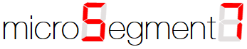
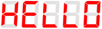
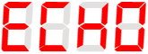
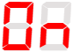
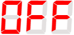
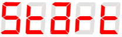
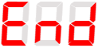
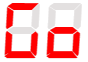
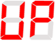
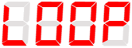

<h2 align="center">  </h2>
<p align="center">

<p align="center">
	<a href="https://www.google.com/search?q=web">
    
  </a>

	
  <a href="https://github.com/virtualvivek/microSegment7">
    
  </a>
  
<a href="https://github.com/vivekverma007/microSegment7/blob/master/LICENSE">
    
  </a>
  
<a href="https://github.com/virtualvivek/microSegment7">
    
  </a>
  
 
</p>

</p>

<p align="center">This library provides modules for <code>7-segment display</code> using <b>8051 microcontroller</b> to perform number counters, system callbacks, general responses, display patterns, available code for both common cathode and common anode.
</p>

<h5></h5>

# Importing the module

## for common-cathode
```c
#include<microSegment7/commonCathode/response.c>
```

## for common-anode
```c
#include<microSegment7/commonAnode/response.c>
```
# Documentation for `Responses`

| Response Name                        | Function                    | Displays Result                                       | 
| :------------------------------------ | :-------------------------- | :----------------------------------------------------------- |
| Hellow | <pre>say_hellow();</pre> |  | 
| Echo | <pre>say_echo();</pre> |  |
| On | <pre>say_on();</pre> |  |
| Off | <pre>say_Off();</pre> |  |
| Start | <pre>say_start();</pre> |  |
| End | <pre>say_end();</pre> |  |
| Pause | <pre>say_pause();</pre> |  |
| Go | <pre>say_go();</pre> |  |
| Up | <pre>say_up();</pre> |  |
| Loop | <pre>say_loop();</pre> |  |


# License

microSegment7 is licensed under `MIT license`. View [license](https://github.com/virtualvivek/microSegment7/blob/master/LICENSE).<br>
Copyright (c) 2019-21 [**Vivek Verma**](https://github.com/virtualvivek)
